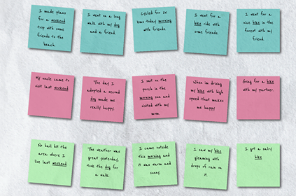

# FP-Happiness

What makes people happy? What topics do people write about to describe happiness? What words do people use to express happiness? These are the questions we seek to investigate through this visualization.

## Team Members:
- Meryl Wang(mswang)
- Renbin Liu(rbliu)
- Stuti Vishwabhan(svishwab)

## Link to Paper:
https://drive.google.com/file/d/1uDaCt6tr3lx5xVRDL0AK6tLD2fp5V3gX/view?usp=sharing

## Instructions for Running:
Visit https://reliu375.github.io/Happy-Moments/. No other installations required.

## Video Demo
https://www.youtube.com/watch?v=KwQGZLy3-8k&feature=youtu.be

## Project Process:

Throughout this project, we meet at a rate around three times a week to assess our current progress and determine deliverables for everyone before the next meeting. We also come up with the narrative and the theme of our visualization webpage first. Then, we determine the content that will answer the main question. With the content in mind, we design each component of the visualization as a mockup, and these mockups will be discussed during meeting and also friends of team members. Finally, we will research relevant D3 packages and implement the visualizations. As for implementation is concerned, we first put up the front end first, then power it with data. Once the implementation is complete, we will conduct a small user study with friends of members to revise our design and implementations.

## Division of Labor:

Meryl spends most of the time on the self-discovery component of the product. This entails the text box for user to enter their own happy moment, then bringing the user's input to the context of the entire dataset. She designs the user interface and implements the tokenization of user input and connect the input to the data. On top of that, Meryl also builds to self-discovery section by designing the user interface and the output section.

Stuti helps building the demographics section. Given the data statistics, she build the bar chart with both linear and logarithmic scale. In addition, she implements the hovering effect and the chart (dis)appearing effect. The interactive features of hovering the mouse over a word in the word cloud is also designed and implemented by her. Stuti also designs the data exploration section and implements a category selection tool and demographic filter. Finally, she introduces and implements the sticky notes that hold examples of happy moments in both self-discovery and data exploration section.

Renbin is the main person taking charge of data processing and production. He helps with exploratory analysis on the data to provide ideas and insight for possible visualizations to build. He is also responsible for cleaning the data and filter out data with incomplete demographic information. Renbin implements data processing script to extract word frequency in the corpus that power the user input and the word cloud section. Finally, he also utilizes d3-fetch package to create data promises in the js files to avoid asynchronous errors.
